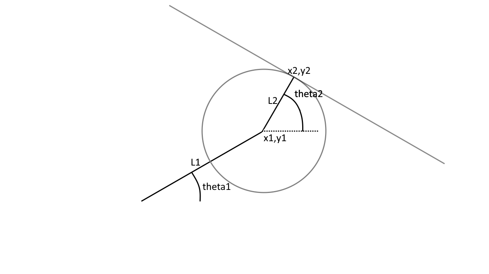

# CVT Dynamics Derivation

# Assumptions
- Constant temperature (no thermal expansion, friction coefficient of belt is constant)
- Engine torque scales with $sin(u\pi/2)$ with throttle, due to rotational intake valve
- Forces and moments related to the CVT ratio are assumed to be quasi-static
    - Justification: shifting occurs at a slower rate than the acceleration of the vehicle itself
    - Benefit: shift ratio is independent of time, only on position and velocity at the current instant
    - Drawback: response of shift ratio deviates from reality, which is not quasi-static
    - True reason: this system would be extremely difficult to model without this assumption
- Friction between certain CVT components are considered negligible
    - Rollers on ramps/helix
    - Friction of sheaves moving during shift
- Belt never slips on secondary sheave

# Constants
Name|Unit|Description
---|:---:|---:
**General**
$\phi$ | rad | Half of the angle between sheaves (also applies to belt V-shape)
$L$ | m | Center to center distance between primary and secondary
$L_{b0}$ | m | Unstretched belt length
$b_{min}$ | m | Minimum width of belt 
$b_{max}$ | m | Maximum width of belt
$h_v$ | m | Height of V-shaped part of belt
$h$ | m | Total height of belt
$A_b$ | m^2 | Belt cross sectional area, specifically the part in between the ridges that can support tensile loads
$m_b$ | kg | Total mass of belt
$E_b$ | Pa | Young's modulus of belt
$\mu_b$ | none | Coefficient of friction of belt with sheaves
$N_g$ | none | Fixed gear ratio between the secondary and the wheels
$I_e$ | kg-m^2 | Total moment of inertia of spinning engine components
$I_p$ | kg-m^2 | Total moment of inertia of primary components with constant inertia values
$I_s$ | kg-m^2 | Total moment of inertia of secondary components with constant inertia values
$I_w$ | kg-m^2 | Total moment of inertia of all four wheels
$m_{car}$ | kg | Total mass of car
$r_{wheel}$ | m | Radius of the wheels
$RPM_{gov}$ | rpm | Engine governor RPM
$RPM_{idle}$ | rpm | Engine idle RPM
$\tau_{e,max} = $ table lookup relating engine torque to engine speed | N-m | Maximum engine torque, based on engine torque curve of N-m vs. rad/s
**Primary CVT Tune**
$ramp(x)$ | function(m) -> m | Function for ramp height vs. x, where x is 0 at the highest ramp point. This function must be continuous, once differentiable, and $ramp'() < 0$. Function must be defined over range $[0, d_{p,max}]$.
$k_p$ | N/m | Linear spring constant for primary spring
$m_{fly}$ | kg | Mass of flyweights, total
**Secondary CVT Tune**
$k_s$ | N/m | Linear spring constant for secondary spring
$\kappa_s$ | N-m/rad | Torsional spring constant for secondary spring
$\theta_{s0}$ | rad | Angular pretension of secondary spring
$\theta_{helix}$ | rad | Angle of the secondary helix ramp
**Primary Subsystem**
$N_{fly}$ | none | Number of flyweight linkages in primary
$r_{inner,p}$ | m | Radius where the bottom of primary sheaves touch
$d_{p,max}$ | m | Max linear gap between primary sheaves
$d_{0p}$ | m | Primary spring initial displacement
$r_{cage}$ | m | Radius from primary axis to outer edge of primary ramp
$r_{shoulder}$ | m | Radius from primary axis to flyweight arm pivot
$L_{arm}$ | m | Length of flyweight arm
$r_{roller}$ | m | Radius of rollers in primary
$x_{ramp}$ | m | Offset from flyweight arm pivot to furthest outwards edge of ramp
$m_{flyarm}$ | kg | Mass of arm connected to flyweight
**Secondary Subsystem**
$r_{inner,s}$ | m | Radius where the bottom of secondary sheaves touch
$d_{s,max}$ | m | Max linear gap between secondary sheaves
$d_{0s}$ | m | Secondary spring initial linear displacement
$r_{helix}$ | m | Radius of secondary helix ramp

# Derived Constants
Formula|Unit|Description
---|:---:|---:
$b = \frac{b_{min} + b_{max}}{2}$ | m | Average width of belt V-shaped section
$r_{p,min} = \frac{\min(d_{p,max},b_{min})/2}{\tan(\phi)} + r_{inner,p} + h_v/2$ | m | Minimum radius of belt around primary
$r_{s,min} = \frac{\min(d_{s,max},b_{min})/2}{\tan(\phi)} + r_{inner,s} + h_v/2$ | m | Minimum radius of belt around secondary
$r_{p,max} = r_{p,min} + \frac{}{}$ | m | Maximum radius of belt around primary
$\rho_b = \frac{m_b}{A_b L_{b0}}$ | kg/m^3 | Density of the belt
$\theta_{s,max} = \frac{d_{s,max}}{r_{helix}\tan(\theta_{helix})}$ | rad | Max angular displacement of secondary sheave and torsional spring

# Time-Dependent Variables
Name|Unit|Description
---|:---:|---:
**Global**
$u_{gas}$ | none | Throttle
$\tau_s$ | N-m | Torque load on the secondary
$\tau_p$ | N-m | Torque load on the primary
$\omega_p$ | rad/s | Angular velocity of primary
$\omega_s$ | rad/s | Angular velocity of secondary
$T_0$ | N | Slack-side belt tension (quasi-static)
$T_1$ | N | Taut-side belt tension (quasi-static)
$L_b$ | m | Current belt length (quasi-static)
**Primary Subsystem**
$d_p$ | m | Linear displacement of primary sheave during shift, range $[0,d_{p,max}]$, initially 0 (quasi-static)
$d_r$ | m | Linear displacement of roller from outermost edge of ramp (quasi-static)
$\theta_1$ | rad | Angle between flyweight arm and primary axis (quasi-static)
$\theta_2$ | rad | Angle between primary ramp surface normal at roller contact point and primary axis (quasi-static)
**Secondary Subsystem**
$d_s$ | m | Linear displacement of secondary sheave during shift, range $[0,d_{s,max}]$, initially 0 (quasi-static)

# Derived Variables
Formula|Unit|Description
---|:---:|---:
$\tau_e = (\tau_{e,max})(\sin(u_{gas}\pi/2)(1 - \frac{RPM_{idle}}{RPM_{gov}}) + \frac{RPM_{idle}}{RPM_{gov}})$  | N-m | Engine torque, scaled based on intake valve angle.
$r_p = d_p/\tan(\phi) + r_{p,min}$ | m | Pulley radius of primary
$r_s = (d_{s,max} - d_s)/\tan(\phi) + r_{s,min}$ | m | Pulley radius of secondary
$\alpha = 2\arccos(\frac{r_s-r_p}{L})$ | rad | Belt wrap angle around primary
$\beta = 2\arccos(\frac{r_p-r_s}{L})$  | rad | Belt wrap angle around secondary
$\theta_s = \frac{d_s}{r_{helix}\tan(\theta_{helix})}$ | rad | Angular twist of secondary spring during shift, range $[0,\theta_{s,max}]$
$r_{fly} = r_{shoulder} + L_{arm} \sin(\theta_1)$ | m | Distance from flyweight to primary axis
$\theta_1 =$ solve numerically | rad | Angle of flyweight arm from primary axis
$\theta_2 =$ solve numerically | rad | Angle of surface normal of primary ramp at roller contact point
$d_r =$ solve numerically | m | Displacement of roller from rightmost edge of ramp
$N_p = \frac{\alpha(F_f)}{\sin(\phi)\ln(F_f + 1)} - \frac{\alpha}{\sin(\phi)}(T_0 - 1)$ | N | Net normal force applied to belt surface at primary

# Forces and Moments
Formula | Description
---|---:
$F_f \le N_p \mu_b$ | No-slip condition
$T_0 = E_b A_b * ((r_p\alpha + r_s\beta + 2\sqrt{L^2 - (r_p - r_s)^2})/L_{b0} - 1) - \rho_b A_b (r_s\omega_s)^2$ | Slack side tension, if belt can stretch
$F1 = ?$ | unknown constant friction force, always opposing shifting
**Primary Subsystem**
$F_{sp} = k_p (d_{0p} + d_p)$ | Force from linear primary spring
$F_{bp} = \frac{\alpha(F_f)}{\tan(\phi)\ln(F_f + 1)} - \frac{\alpha}{\tan(\phi)}(T_0 - 1)$ | Force from belt
$F_{flyarm} = \frac{0.25 m_{fly}(r_{shoulder} + L_{arm}\sin(\theta_1))\omega_p^2 L_{arm} \cos(\theta_1) \cos(\theta_2)}{L_{arm}\sin(\theta_1 + \theta_2) + r_{roller}\sin(2\theta_2)}$ | Force from flyweights and ramp
**Secondary Subsystem**
$F_{ss} = k_s (d_{0s} + d_s)$ | Force from linear secondary spring
$F_{bs} = \frac{\beta(F_{f,s})}{\tan(\phi)\ln(F_{f,s} + 1)} - \frac{\beta}{\tan(\phi)}(T_0 - 1)$ | Force from belt
$\tau_{ss} = \kappa_s (\theta_{s0} + \theta_s)$ | Torque from torsional secondary spring
$F_{helix} = \frac{\tau_s/2 + \tau_{ss}}{r_{helix}\tan(\theta_{helix})}$ | Force from helix, based on applied torque and torsional spring

# Vehicle Dynamics
Formula | Description
---|---:
$\tau_{cvt} = F_f*r_s$ | Torque output by the CVT
$\tau_g = N_g \tau_{cvt} $ | Torque output by the gearcase
$F_{wheel} = \tau_g / r_{wheel}$ | Force output by the wheels on the ground

# Derivation of $r_p, r_s$

$r_p = d_p/\tan(\phi) + r_{p,min}$

$r_s = (d_{s,max} - d_s)/\tan(\phi) + r_{s,min}$

$d_p = \tan(\phi)(r_p - r_{p,min})$

$d_s = d_{s,max} - \tan(\phi)(r_s - r_{s,min})$

$r_{min} = r_{inner} + h_v/2$

$r_{p,max} = d_{p,max}/\tan(\phi) + r_{p,min}$

$r_{s,max} = d_{s,max}/\tan(\phi) + r_{s,min}$

# Derivation of $\theta_s$

Tangent = opposite/adjacent

$\tan(\theta_{helix}) = \frac{d_s}{\theta_s r_{helix}}$

Solve for $\theta_s$

$\theta_s r_{helix} \tan(\theta_{helix}) = d_s$

$\theta_s = \frac{d_s}{r_{helix} \tan(\theta_{helix})}$

# Derivation of $F_b$ vs Tension

$F_b$ depends on belt tension and sheave geometry:

$N = F_b/\cos(\phi) = R/\sin(\phi)$

$F_b = R/\tan(\phi)$

$R = F_b\tan(\phi)$ where R is a radial force on the sheave due to belt tension, and $\phi$ is half the V angle.

$R = N\sin(\phi)$

$F_b = N\cos(\phi)$

Something to note is that $R$ is influenced by centripetal force, $F_c$.

$F_c = mr\omega^2$

In the case of the belt, centripetal force along each element is based on this:

$dF_c = \rho A r d\theta\omega_p^2$

If the sheave is not slipping, then the static friction condition holds:

$F_f \le F_{f,max} = \mu_b N$, and $F_f$ is like a reaction force.
This reaction force is applied at every point along the belt contact surface. If the total moment from these reaction forces is balanced with the applied torque on the sheave and belt tension, then we can solve for F_f and verify that the static friction condition holds.

Taking sum of forces along the tangential and radial directions for a small slice of the belt contact area:

$\sum{F_{tangential}} = 0 = (-T) + (T + dT) - F_f$

$dT = F_f$

Applying small angle approximations:

$\sum{F_{radial}} = 0 = T d\theta + dT d\theta/2 - dR$

$dR = T d\theta + dT/2 d\theta$

Assuming that dT/2 is very small, approximately:

$dR = T d\theta$

$dN\sin(\phi) = T d\theta$

$\frac{dN}{d\theta}\sin(\phi) = T$

Assuming that $T(\theta)$ is in the form of an exponential, based on the derivations from WVU and Bestorq:

$T(\theta) = e^{C\theta} + Q$ where $T(0) = T_0$ and $T(\alpha) = T_1$

$Q = T_0 - 1$

$C = \frac{\ln(T_1-T_0+1)}{\alpha}$

$T(\theta) = (T_1 - T_0 + 1)^{\theta/\alpha} - 1 + T_0$

$\sin(\phi) \frac{dN}{d\theta} = (T_1 - T_0 + 1)^{\theta/\alpha} - 1 + T_0$

Integrating both sides wrt $d\theta$ with bounds $[0, \alpha]$ for $\theta$

$N \sin(\phi) = \int_0^\alpha{((T_1 - T_0 + 1)^{\theta/\alpha} - 1 + T_0) d\theta}$

$= \int_0^\alpha{((T_1 - T_0 + 1)^{\theta/\alpha}) d\theta} - \alpha(T_0 - 1)$

$= \int_0^\alpha{(e^{\ln(T_1 - T_0 + 1)\theta/\alpha}) d\theta} - \alpha(T_0 - 1)$

$= \frac{\alpha}{\ln(T_1 - T_0 + 1)} [e^{\ln(T_1 - T_0 + 1)\theta/\alpha}]_0^\alpha - \alpha(T_0 - 1)$

$= \frac{\alpha}{\ln(T_1 - T_0 + 1)} (e^{\ln(T_1 - T_0 + 1)} - 1) - \alpha(T_0 - 1)$

$= \frac{\alpha(T_1 - T_0)}{\ln(T_1 - T_0 + 1)} - \alpha(T_0 - 1)$

Assuming static equilibrium, all torques must cancel:

$T_1 - T_0 = F_f$

$N \sin(\phi) = \frac{\alpha(F_f)}{\ln(F_f + 1)} - \alpha(T_0 - 1)$

$N = \frac{\alpha(F_f)}{\sin(\phi)\ln(F_f + 1)} - \frac{\alpha}{\sin(\phi)}(T_0 - 1)$

Substituting for $F_b$:

$F_b = N\cos(\phi)$

$F_b = \frac{\alpha(F_f)}{\tan(\phi)\ln(F_f + 1)} - \frac{\alpha}{\tan(\phi)}(T_0 - 1)$

For the secondary, replace $\alpha$ with $\beta$ and $\omega_p$ with $\omega_s$.

This gives us a relationship between slack side tension force and the normal force.

Once we can determine $T_0$, the rest of the system falls into place.

To determine whether the system will be slipping, we need to calculate $F_f$ assuming no slip:

$F_f = \tau_p/r_p + \tau_s/r_s$

If the friction "reaction" force $F_f > \mu_b N$, then the sheave is slipping and torque is limited by kinetic friction:

$F_f = \mu_b N$

# Derivation of $T_0$

If the basis of slack tension is the spring-like behavior of the belt stretching,
then wen the belt stretches, there is a static tension through the whole belt, which is T0.

$T_0 = E_b A_b * (L_b - L_{b0}) / L_{b0}$

$L_b = L_p + L_s + 2L_{mid}$

$L_b = r_p\alpha + r_s\beta + 2\sqrt{L^2 - (r_p - r_s)^2}$

Substituting $L_b$:

$T_0 = E_b A_b * ((r_p\alpha + r_s\beta + 2\sqrt{L^2 - (r_p - r_s)^2})/L_{b0} - 1)$

In addition, there is an effect due to centripetal force. The force effectively acts in opposition to slack side tension.

$T_c = \rho_b A_b (r_s\omega_s)^2$ Secondary-based linear belt speed is used, because the secondary is always assumed to have the no-slip condition.

(tec-science.com)

$T_0 = E_b A_b * ((r_p\alpha + r_s\beta + 2\sqrt{L^2 - (r_p - r_s)^2})/L_{b0} - 1) - \rho_b A_b (r_s\omega_s)^2$ 

# Constant Belt Length Assumption

However, after an initial implementation of the numeric solution to the CVT shift, it was determined that the belt stretching is the third degree of freedom in the system which introduces instability in the solver. The instabilty comes from the change in belt stretch being on a much smaller order of magnitude to the other values. So, in order to make the system's numerical solution with gradient descent more stable, the assumption that the belt doesn't stretch makes the solution more stable and faster to solve.

No belt stretch assumption:

$L_{b0} = r_p\alpha + r_s\beta + 2\sqrt{L^2 - (r_p - r_s)^2}$

Assuming that the belt doesn't stretch does not mean there is no static tension, it is just that the static tension is like a reaction force between the primary and secondary. Keeping in mind the derivation of F_b, the force on the sheave from the belt is correlated with T0 and F_f.

If we constrain T1, T0, and by extension F_f, to be equal between the sheaves, then we get the following relation:

$F_b = \frac{\alpha(F_f)}{\tan(\phi)\ln(F_f + 1)} - \frac{\alpha}{\tan(\phi)}(T_0 - 1)$

$\frac{F_f}{\ln(F_f + 1)} - F_{bp} \frac{\tan(\phi)}{\alpha} - 1 = T_0$

$\frac{F_f}{\ln(F_f + 1)} - F_{bs} \frac{\tan(\phi)}{\beta} - 1 = T_0$

$\frac{F_f}{\ln(F_f + 1)} - F_{bp} \frac{\tan(\phi)}{\alpha} - 1 = \frac{F_f}{\ln(F_f + 1)} - F_{bs} \frac{\tan(\phi)}{\beta} - 1$

$F_{bp} \frac{\tan(\phi)}{\alpha} = F_{bs} \frac{\tan(\phi)}{\beta}$

$\frac{F_{bp}}{\alpha} = \frac{F_{bs}}{\beta}$

$F_{bs} = F_{bp}\frac{\beta}{\alpha}$

Substituting this relation into the force balance equations for the primary and secondary:

$0 = F_{sp} + F_{bp} - 4F_{flyarm}$

$0 = F_{ss} - F_{bp}\frac{\beta}{\alpha} + \frac{\tau_s/2 + \tau_{ss}}{r_{helix}\tan(\theta_{helix})}$

Setting both equations equal to $F_{bp}$:

$F_{bp} = 4F_{flyarm} - F_{sp}$

$F_{bp} = \frac{\alpha}{\beta} (F_{ss} + \frac{\tau_s/2 + \tau_{ss}}{r_{helix}\tan(\theta_{helix})})$

$4F_{flyarm} - F_{sp} = \frac{\alpha}{\beta} (F_{ss} + \frac{\tau_s/2 + \tau_{ss}}{r_{helix}\tan(\theta_{helix})})$

$0 = F_{sp} - 4F_{flyarm} + \frac{\alpha}{\beta} (F_{ss} + \frac{\tau_s/2 + \tau_{ss}}{r_{helix}\tan(\theta_{helix})})$

$0 = \beta (F_{sp} - 4F_{flyarm}) + \alpha (F_{ss} + \frac{\tau_s/2 + \tau_{ss}}{r_{helix}\tan(\theta_{helix})})$

Now we have a force balance equation that relates the primary and the secondary that does not depend on belt tension.

If the belt is assumed to stay a constant length, then a different strategy is needed to check if the belt is slipping.

If we assume a constant belt length and a no-slip condition, then the force from the belt is proportional to wrap angles between the primary and secondary:

$F_{bp} = 4F_{flyarm} - F_{sp} = (F_{ss} + F_{helix}) \frac{\alpha}{\beta}$

$N = \frac{F_b}{\cos(\phi)}$

$N = \frac{4F_{flyarm} - F_{sp}}{\cos(\phi)}$

The no slip condition: $F_f \le \mu_b N$

No slip: $F_f = \tau_e/r_p + \tau_s/r_s$

Slipping: $F_f = \mu_b N$

# Derivation of $F_{bs}$

Moments on nonmoving sheave: $0 = -\tau_s - \tau_{ss} + T_{1s1}r_s - T_{0s1}r_s + r_{helix} N_{helix} \sin(\theta_{helix})$

Moments on moving sheave: $0 = \tau_{ss} + T_{1s2} r_s - T_{0s2} r_s - r_{helix} N_{helix} \sin(\theta_{helix})$

Axial Forces on moving sheave: $0 = F_{ss} - F_{bs} + N_{helix} \cos(\theta_{helix})$

Tensions must sum to their respective totals:
 
$T_1 == T_{1s1} + T_{1s2}$

$T_0 == T_{0s1} + T_{0s2}$

Relation between primary friction force and tension: $F_f = T_1 - T_0$

If we solve the two moment equations:

$0 = -\tau_s - \tau_{ss} + (T_{1s1} - T_{0s1}) r_s + r_{helix} N_{helix} \sin(\theta_{helix})$

$\tau_{ss} = -tau_s + (T_{1s1} - T_{0s1}) r_s + r_{helix} N_{helix} \sin(\theta_{helix})$

$0 = \tau_{ss} + (T_{1s2} - T_{0s2}) r_s - r_{helix} N_{helix} \sin(\theta_{helix})$

$0 = -\tau_s + (T_{1s1} - T_{0s1}) r_s + r_{helix} N_{helix} \sin(\theta_{helix}) + (T_{1s2} - T_{0s2}) r_s - r_{helix} N_{helix} \sin(\theta_{helix})$

$0 = -\tau_s + (T_{1s1} - T_{0s1}) r_s + (T_{1s2} - T_{0s2}) r_s$

$0 = -\tau_s + r_s (T_{1s1} - T_{0s1} + T_{1s2} - T_{0s2})$

$0 = -\tau_s + r_s (T_{1s1} - T_{0s1} + T_{1s2} - T_{0s2})$

$0 = -\tau_s + r_s (F_f)$

This is true, but doesn't tell us anything new.

If we instead subtract the two moment equations from each other:

$0 = \tau_{ss} + T_{1s2} r_s - T_{0s2} r_s - r_{helix} N_{helix} \sin(\theta_{helix}) + \tau_s + \tau_{ss} - T_{1s1}r_s + T_{0s1}r_s - r_{helix} N_{helix} \sin(\theta_{helix})$

$0 = 2 \tau_{ss} + r_s (T_{1s2} - T_{0s2} - T_{1s1} + T_{0s1}) - 2 r_{helix} N_{helix} \sin(\theta_{helix}) + \tau_s$

Solving for $N_{helix}$:

$2 r_{helix} N_{helix} \sin(\theta_{helix}) = 2 \tau_{ss} + r_s (T_{1s2} - T_{0s2} - T_{1s1} + T_{0s1}) + \tau_s$

$r_{helix} N_{helix} \sin(\theta_{helix}) = \tau_{ss} + 0.5 r_s (T_{1s2} - T_{0s2} - T_{1s1} + T_{0s1}) + 0.5 \tau_s$

$N_{helix} = \frac{\tau_{ss} + 0.5 r_s (T_{1s2} - T_{0s2} - T_{1s1} + T_{0s1}) + 0.5 \tau_s}{r_{helix} \sin(\theta_{helix})}$

If we assume that either sheave's tensions are equal, then the tension term disappears.
This is justified by the assumption that the belt does not deform.
If the tensions on either side of the belt are different, it will cause the belt to skew its shape.
The only way for this to not occur is to have each sheave apply equal friction force (applied tension).

$N_{helix} = \frac{\tau_{ss} + 0.5 \tau_s}{r_{helix} \sin(\theta_{helix})}$

$F_{bs} = F_{ss} + \frac{\tau_{ss} + 0.5 \tau_s}{r_{helix} \tan(\theta_{helix})}$

# Derivation of $\theta_1, \theta_2, d_p$

The reaction force from the flyweight arm must be determined using kinematics. The system acts like a 2-bar linkage where the first link extends from the point "R" to the roller with length $L$ and angle $\theta_R$. The second link extends from the roller to the edge of the ramp with length $r_{roller}$ and angle $\theta_N$

An important note is that the ramp is defined by an arbitrary function, ramp(d), which returns a height from the base of the ramp. It is assumed that any result of this function will have the two-bar linkage in an "elbow-up" state, as shown in the figure. This is true if the slope of the ramp() function is always negative.

Solving this system is not trivial, since the function $ramp(d)$ is arbitrary. It means that the equations involving it cannot isolate its arguments, since the function is not known to be invertable.

Free variables (7): $x_1, y_1, x_2, y_2, \theta_1, \theta_2, d_r$

Knowns: $L_1, L_2, x_{ramp}, d_p, r_{cage}, r_{shoulder}$ (Note: $L_1 = L_{arm}$ and $L_2 = r_{roller}$)

Arbitrary: $ramp(), ramp'()$

$x_1 = L_1\cos(\theta_1)$

$y_1 = L_1\sin(\theta_1)$

$x_1 = x_{ramp} + d_p - d_r$

$x_2 = x_1 + L_2\cos(\theta_2)$

$y_2 = r_{cage} - r_{shoulder} - ramp(d_r - L_2\cos(\theta_2))$

$y_2 = y_1 + L_2\sin(\theta_2)$

$\theta_2 = \arctan(ramp'(d_r - L_2\cos(\theta_2))) + \pi/2$ where $ramp'(x) = \frac{d}{dx}ramp(x)$

With these 7 equations, we could in theory solve for every variable, if $ramp(x)$ wasn't arbitrary.
This nonlinear system must be solved numerically.
It can be simplified to this system of 3 equations where the variables are $d_r, \theta_1, \theta_2$:

eq1: $0 = L_1*\cos(\theta_1) - x_{ramp} - d_p + d_r$

eq2: $0 = L_1\sin(\theta_1) + L_2\sin(\theta_2) - r_{cage} + r_{shoulder} + ramp(d_r - L_2\cos(\theta_2))$

eq3: $0 = \arctan(ramp'(d_r - L_2\cos(\theta_2))) + \pi/2 - \theta_2$

The penalty method can be used, where penalty (E) is minimized. Penalty is the sum of the right side of each equation squared.
The square is to make the value unsigned and to make larger deviations from zero have much more penalty.

$E = eq_1^2 + eq_2^2 + eq_3^2$

Bounds need to be placed on $\theta_1$ and $\theta_2$ such that they remain in the range $[-\pi,\pi]$, otherwise the numerical solver may not converge due to the symmetry of angles.
An alternative way to address the problem is to evaluate all $\theta$ as $\theta \mod 2\pi$.

# Derivation of $F_{flyarm}$

To find the reaction force $F_{flyarm}$, we need to use the centripetal force due to rotation of the primary.

$F_c = mr\omega^2$ where $m = m_{fly}/4, r = r_{fly}, \omega=\omega_p$

The two-bar linkage is usually applied in robotics, where the middle linkage can move. However, in this case the second link is a result of the roller on the ramp surface, so the entire ramp and roller piece can be treated as a single rigid body.

When solving for the forces and moments, forces in the x and y direction must be cancelled.
This is because the linkage arm itself does not move relative to its pivot point, it only rotates.
Because shifting occurs over a relatively long period of time, and the components of the flyweight arm assembly are so light compared to the rest of the assembly,
the quasi-static assumption can be used on this subsystem. The only information we would gain by not using it is the slight effect the momentum of the flyweight arm on shifting.
Most of the influence of momentum is captured by the flyweight's centripetal force, and not solving this system as quasi-static would be extremely difficult.

$\sum{F_x} = 0 = F_{flyarm} - N\cos(\theta_2)$

$\sum{F_y} = 0 = R_y - N\sin(\theta_2) + F_c$

$\sum{M_z} = 0 = F_c L_{arm} \cos(\theta_1) - N x_2 \sin(\theta_2) - N y_2 \cos(\theta_2)$

where $x_2 = L_{arm}\cos(\theta_1) + r_{roller}\cos(\theta_2)$

and $y_2 = L_{arm}\sin(\theta_1) + r_{roller}\sin(\theta_2)$

Solving for N in the moment equation:

$N = \frac{F_c L_{arm} \cos(\theta_1)}{x_2 \sin(\theta_2) + y_2 \cos(\theta_2)}$

The $F_y$ equation does not reveal any relevant information to the rest of the problem.

Plugging in $N$ into the $F_x$ equation:

$F_{flyarm} = \frac{F_c L_{arm} \cos(\theta_1) \cos(\theta_2)}{x_2 \sin(\theta_2) + y_2 \cos(\theta_2)}$

Expanding all intermediate values:

$F_{flyarm} = \frac{(0.25 m_{fly}r_{fly}\omega_p^2) L_{arm} \cos(\theta_1) \cos(\theta_2)}{\sin(\theta_2) (L_{arm}\cos(\theta_1) + r_{roller}\cos(\theta_2)) + \cos(\theta_2) (L_{arm}\sin(\theta_1) + r_{roller}\sin(\theta_2))}$

$F_{flyarm} = \frac{(0.25 m_{fly}r_{fly}\omega_p^2) L_{arm} \cos(\theta_1) \cos(\theta_2)}{(L_{arm}\cos(\theta_1)\sin(\theta_2) + r_{roller}\cos(\theta_2)\sin(\theta_2)) + (L_{arm}\sin(\theta_1)\cos(\theta_2) + r_{roller}\sin(\theta_2)\cos(\theta_2))}$

Reducing number of trig evaluations with identities:

$\sin(\theta_2)\cos(\theta_2) = \sin(2\theta_2)/2$

$\cos(\theta_1)\sin(\theta_2) + \cos(\theta_2)\sin(\theta_1) = \sin(\theta_1 + \theta_2)$

$F_{flyarm} = \frac{(0.25 m_{fly}r_{fly}\omega_p^2) L_{arm} \cos(\theta_1) \cos(\theta_2)}{L_{arm}\cos(\theta_1)\sin(\theta_2) + r_{roller}\sin(2\theta_2)/2 + L_{arm}\sin(\theta_1)\cos(\theta_2) + r_{roller}\sin(2\theta_2)/2}$

$F_{flyarm} = \frac{(0.25 m_{fly}r_{fly}\omega_p^2) L_{arm} \cos(\theta_1) \cos(\theta_2)}{L_{arm}\cos(\theta_1)\sin(\theta_2) + L_{arm}\sin(\theta_1)\cos(\theta_2) + r_{roller}\sin(2\theta_2)}$

$F_{flyarm} = \frac{0.25 m_{fly}r_{fly}\omega_p^2 L_{arm} \cos(\theta_1) \cos(\theta_2)}{L_{arm}\sin(\theta_1 + \theta_2) + r_{roller}\sin(2\theta_2)}$

$F_{flyarm} = \frac{0.25 m_{fly}(r_{shoulder} + L_{arm}\sin(\theta_1))\omega_p^2 L_{arm} \cos(\theta_1) \cos(\theta_2)}{L_{arm}\sin(\theta_1 + \theta_2) + r_{roller}\sin(2\theta_2)}$

# Derivation of Vehicle Dynamics

Find sum of forces on effective mass of car (mass plus inertia times radius).

Conversion between mass and inertia: (mass) kg = (inertia times distance squared) kg-m^2 * 1/m^2

$\ddot{x} m = F$

$\ddot{x} (m_{car} + (I_e + I_p)(\frac{N_g r_s}{r_{wheel} r_p})^2 + I_s (\frac{N_g}{r_{wheel}})^2 + I_w(\frac{1}{r_{wheel}})^2) = F_f \frac{r_s N_g}{r_{wheel}} + m_{car} g \sin(\theta_{ground})$

$\ddot{x} = \frac{F_f \frac{r_s N_g}{r_{wheel}} + m_{car} g \sin(\theta_{ground})}{m_{car} + (I_e + I_p)(\frac{N_g r_s}{r_{wheel} r_p})^2 + I_s (\frac{N_g}{r_{wheel}})^2 + I_w(\frac{1}{r_{wheel}})^2}$

After solving for force equilibrium in the CVT using the applied torque from the engine and the external environment,
the velocity can be changed by being the integral of acceleration.

Using midpoint numeric integration:

$\dot{x}|_{t} = \frac{\ddot{x}|_{t} + \ddot{x}|_{t - \Delta t}}{2} \Delta t$

If the CVT belt is not slipping on the primary, then the following condition must hold:

$\omega_p r_p = \omega_s r_s$

However, momenutum must be conserved. We can consider the effective angular momentum ("H") of all components:

$H = (I_p + I_e) w_p + I_s w_s + I_w (w_s/N_g) + m_{car}(w_s/N_g)r_{wheel}^2$

To correct the ratio of speeds between the primary and secondary, we can solve the two above equations for adjusted angular velocities:

$w_{p,adj} = \frac{H N_g r_s}{m_{car} r_p r_{wheel}^2 + I_w r_p + I_e N_g r_s + I_p N_g r_s + I_s N_g r_p}$

$w_{s,adj} = w_{p,adj} \frac{r_p}{r_s}$

# Misc Notes

- Evaluate fitness of shift curve by optimizing SSE
- Tune accuracy of system by optimizing the sum of SSE optimizations for all test cases

# References

Arora, Jasbir Singh. Introduction to optimum design. Elsevier, 2004.

BESTORQ. "Belt Theory". https://www.bestorq.com/techinfo.asp, Accessed Oct. 2024.

Skinner, Sean Sebastian. "Modeling and Tuning of CVT Systems for SAE® Baja Vehicles". West Virginia University, 2020.

tec-science.com. "Centrifugal forces in the belt of a belt drive". https://www.tec-science.com/mechanical-power-transmission/belt-drive/centrifugal-forces/, Accessed Oct. 2024.

